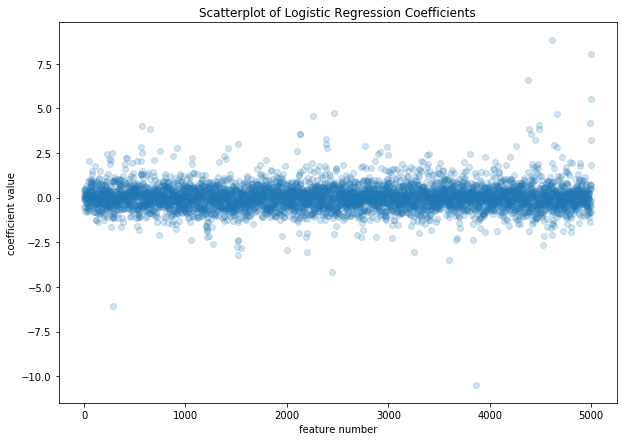

## Contents
{:.no_toc}
*  
{: toc}


```python
import pandas as pd
import numpy as np
from sklearn import feature_extraction
from sklearn import linear_model
from sklearn import preprocessing
from scipy import sparse
```


## Load Data and Train/Test Split(s)


```python
df=pd.read_json("../data/merged_troll_data.json")
```


```python
df.shape
```


    (332504, 8)


```python
df.sample(5).head()
```


<div>
<style scoped>
    .dataframe tbody tr th:only-of-type {
        vertical-align: middle;
    }

    .dataframe tbody tr th {
        vertical-align: top;
    }

    .dataframe thead th {
        text-align: right;
    }
</style>
<table border="1" class="dataframe">
  <thead>
    <tr style="text-align: right;">
      <th></th>
      <th>content</th>
      <th>followers</th>
      <th>following</th>
      <th>retweet</th>
      <th>account_category</th>
      <th>created_at</th>
      <th>troll</th>
      <th>orig_index</th>
    </tr>
  </thead>
  <tbody>
    <tr>
      <th>294412</th>
      <td>We NEED a Special Prosecutor...NOW!! https://t...</td>
      <td>57</td>
      <td>66</td>
      <td>0</td>
      <td>NonTroll</td>
      <td>2016-10-25 04:26:51</td>
      <td>False</td>
      <td>2801</td>
    </tr>
    <tr>
      <th>330038</th>
      <td>RT @tmckernan: From #KenBone: I went into the ...</td>
      <td>373</td>
      <td>143</td>
      <td>1</td>
      <td>NonTroll</td>
      <td>2016-10-10 13:20:32</td>
      <td>False</td>
      <td>400554</td>
    </tr>
    <tr>
      <th>283123</th>
      <td>@realDonaldTrump you are wrong Donald, it was ...</td>
      <td>111</td>
      <td>141</td>
      <td>0</td>
      <td>NonTroll</td>
      <td>2016-10-20 02:23:20</td>
      <td>False</td>
      <td>16201</td>
    </tr>
    <tr>
      <th>330288</th>
      <td>RT @atensnut: Hillary calls Trump's remarks "h...</td>
      <td>534</td>
      <td>445</td>
      <td>1</td>
      <td>NonTroll</td>
      <td>2016-10-09 03:59:14</td>
      <td>False</td>
      <td>29403</td>
    </tr>
    <tr>
      <th>272847</th>
      <td>@realDonaldTrump @TeamTrump @MELANIATRUMP @Iva...</td>
      <td>14045</td>
      <td>12881</td>
      <td>0</td>
      <td>NonTroll</td>
      <td>2016-10-10 08:42:21</td>
      <td>False</td>
      <td>65000</td>
    </tr>
  </tbody>
</table>
</div>


```python
ids=pd.read_json("../data/train_test_inds.json")
```


```python
len(ids.random.train)
```


    266003


## Prepare feature matrix

### Isolate matrices


```python
def getxy(ids, feature_cols=['content', 'followers', 'following', 'retweet'], label_col=['troll']):
    return df[feature_cols].iloc[ids], df[label_col].iloc[ids]
```


```python
# random
Xrand_train, yrand_train = getxy(ids.random.train)
Xrand_val, yrand_val = getxy(ids.random.val)
Xrand_test, yrand_test = getxy(ids.random.test)

# temporal
Xtemp_train, ytemp_train = getxy(ids.temporal.train)
Xtemp_val, ytemp_val = getxy(ids.temporal.val)
Xtemp_test, ytemp_test = getxy(ids.temporal.test)
```


```python
Xrand_train.head()
```


<div>
<style scoped>
    .dataframe tbody tr th:only-of-type {
        vertical-align: middle;
    }

    .dataframe tbody tr th {
        vertical-align: top;
    }

    .dataframe thead th {
        text-align: right;
    }
</style>
<table border="1" class="dataframe">
  <thead>
    <tr style="text-align: right;">
      <th></th>
      <th>content</th>
      <th>followers</th>
      <th>following</th>
      <th>retweet</th>
    </tr>
  </thead>
  <tbody>
    <tr>
      <th>204024</th>
      <td>RT @businessinsider: OBAMA: The press doesn’t ...</td>
      <td>14525</td>
      <td>3311</td>
      <td>1</td>
    </tr>
    <tr>
      <th>45854</th>
      <td>Review: Generation Startup https://t.co/lej8O8...</td>
      <td>3086</td>
      <td>2387</td>
      <td>1</td>
    </tr>
    <tr>
      <th>199686</th>
      <td>RT @Kidrambler: @TomiLahren Vote for Gary John...</td>
      <td>1117</td>
      <td>3742</td>
      <td>1</td>
    </tr>
    <tr>
      <th>115712</th>
      <td>in interpersonal relations with pple who are m...</td>
      <td>936</td>
      <td>582</td>
      <td>1</td>
    </tr>
    <tr>
      <th>245728</th>
      <td>RT @PeterTownsend7: The Real #WarOnWomen  #isi...</td>
      <td>2891</td>
      <td>1615</td>
      <td>1</td>
    </tr>
  </tbody>
</table>
</div>


```python
Xrand_train.shape, yrand_train.shape
```


    ((266003, 4), (266003, 1))


### Tokenize content


```python
vocab_size=5000
tokenizer=feature_extraction.text.CountVectorizer(stop_words='english', max_features=vocab_size)
tokenizer=tokenizer.fit(df['content'])
```


```python
Xrand_train_tok=tokenizer.transform(Xrand_train['content'])
Xrand_val_tok=tokenizer.transform(Xrand_val['content'])
Xrand_test_tok=tokenizer.transform(Xrand_test['content'])

Xtemp_train_tok=tokenizer.transform(Xtemp_train['content'])
Xtemp_val_tok=tokenizer.transform(Xtemp_val['content'])
Xtemp_test_tok=tokenizer.transform(Xtemp_test['content'])
```


```python
Xrand_train_tok.shape # token matrix dim = n x vocab_size
```


    (266003, 5000)


### Standardize followers/following


```python
# one for each split
rand_scaler = preprocessing.StandardScaler().fit(Xrand_train[['followers','following']])
temp_scaler = preprocessing.StandardScaler().fit(Xtemp_train[['followers','following']])
```


```python
print('rand means and scales: {}, {}'.format(rand_scaler.mean_, rand_scaler.scale_))
print('temp means and scales: {}, {}'.format(temp_scaler.mean_, rand_scaler.scale_))
```


    rand means and scales: [8154.90645218 3016.03233422], [219679.05451009   7816.52064337]
    temp means and scales: [8757.68069533 3020.22409146], [219679.05451009   7816.52064337]


They are very close. Could probably just use a single one, but I will use both anyways, in case it makes a difference.


```python
col_to_std = ['followers', 'following']
Xrand_train[col_to_std]=rand_scaler.transform(Xrand_train[col_to_std])
Xrand_val[col_to_std]=rand_scaler.transform(Xrand_val[col_to_std])
Xrand_test[col_to_std]=rand_scaler.transform(Xrand_test[col_to_std])

Xtemp_train[col_to_std]=temp_scaler.transform(Xtemp_train[col_to_std])
Xtemp_val[col_to_std]=temp_scaler.transform(Xtemp_val[col_to_std])
Xtemp_test[col_to_std]=temp_scaler.transform(Xtemp_test[col_to_std])
```


```python
Xrand_train[col_to_std].head()
```


<div>
<style scoped>
    .dataframe tbody tr th:only-of-type {
        vertical-align: middle;
    }

    .dataframe tbody tr th {
        vertical-align: top;
    }

    .dataframe thead th {
        text-align: right;
    }
</style>
<table border="1" class="dataframe">
  <thead>
    <tr style="text-align: right;">
      <th></th>
      <th>followers</th>
      <th>following</th>
    </tr>
  </thead>
  <tbody>
    <tr>
      <th>204024</th>
      <td>0.028997</td>
      <td>0.037736</td>
    </tr>
    <tr>
      <th>45854</th>
      <td>-0.023074</td>
      <td>-0.080475</td>
    </tr>
    <tr>
      <th>199686</th>
      <td>-0.032037</td>
      <td>0.092876</td>
    </tr>
    <tr>
      <th>115712</th>
      <td>-0.032861</td>
      <td>-0.311396</td>
    </tr>
    <tr>
      <th>245728</th>
      <td>-0.023962</td>
      <td>-0.179240</td>
    </tr>
  </tbody>
</table>
</div>


### Binarize the boolean outcome


```python
yrand_train.head()
```


<div>
<style scoped>
    .dataframe tbody tr th:only-of-type {
        vertical-align: middle;
    }

    .dataframe tbody tr th {
        vertical-align: top;
    }

    .dataframe thead th {
        text-align: right;
    }
</style>
<table border="1" class="dataframe">
  <thead>
    <tr style="text-align: right;">
      <th></th>
      <th>troll</th>
    </tr>
  </thead>
  <tbody>
    <tr>
      <th>204024</th>
      <td>False</td>
    </tr>
    <tr>
      <th>45854</th>
      <td>True</td>
    </tr>
    <tr>
      <th>199686</th>
      <td>False</td>
    </tr>
    <tr>
      <th>115712</th>
      <td>True</td>
    </tr>
    <tr>
      <th>245728</th>
      <td>False</td>
    </tr>
  </tbody>
</table>
</div>


```python
bool_to_bin = lambda x: 1 if x else 0
yrand_train['troll'] = yrand_train['troll'].apply(bool_to_bin)
yrand_train.head()
```


<div>
<style scoped>
    .dataframe tbody tr th:only-of-type {
        vertical-align: middle;
    }

    .dataframe tbody tr th {
        vertical-align: top;
    }

    .dataframe thead th {
        text-align: right;
    }
</style>
<table border="1" class="dataframe">
  <thead>
    <tr style="text-align: right;">
      <th></th>
      <th>troll</th>
    </tr>
  </thead>
  <tbody>
    <tr>
      <th>204024</th>
      <td>0</td>
    </tr>
    <tr>
      <th>45854</th>
      <td>1</td>
    </tr>
    <tr>
      <th>199686</th>
      <td>0</td>
    </tr>
    <tr>
      <th>115712</th>
      <td>1</td>
    </tr>
    <tr>
      <th>245728</th>
      <td>0</td>
    </tr>
  </tbody>
</table>
</div>


```python
yrand_val['troll'] = yrand_val['troll'].apply(bool_to_bin)
yrand_test['troll'] = yrand_test['troll'].apply(bool_to_bin)

ytemp_train['troll'] = ytemp_train['troll'].apply(bool_to_bin)
ytemp_val['troll'] = ytemp_val['troll'].apply(bool_to_bin)
ytemp_test['troll'] = ytemp_test['troll'].apply(bool_to_bin)
```


### Concatenate features


```python
def concatenate_features(tok_matrix, data_df):
    """ concatenate the tokenized matrix (scipy.sparse) with other features """
    sparse_cols = sparse.csr_matrix(data_df[['followers', 'following', 'retweet']])
    combined = sparse.hstack([tok_matrix, sparse_cols])
    return combined
```


```python
Xrand_train_combined = concatenate_features(Xrand_train_tok, Xrand_train)
Xrand_val_combined = concatenate_features(Xrand_val_tok, Xrand_val)
Xrand_test_combined = concatenate_features(Xrand_test_tok, Xrand_test)

Xtemp_train_combined = concatenate_features(Xtemp_train_tok, Xtemp_train)
Xtemp_val_combined = concatenate_features(Xtemp_val_tok, Xtemp_val)
Xtemp_test_combined = concatenate_features(Xtemp_test_tok, Xtemp_test)
```


```python
Xrand_train_combined.shape # combined is n * tok_dim + 3 features
```


    (266003, 5003)


## Train the model(s)

### Using only text


```python
# random split
logit_rand = linear_model.LogisticRegression().fit(Xrand_train_tok, yrand_train['troll'])
```


```python
logit_rand.score(Xrand_val_tok, yrand_val['troll'])
```


    0.9000601503759399


```python
logit_rand.score(Xrand_test_tok, yrand_test['troll'])
```


    0.9054464527382635


```python
# temporal split
logit_temp = linear_model.LogisticRegression().fit(Xtemp_train_tok, ytemp_train['troll'])
```


```python
logit_temp.score(Xtemp_val_tok, ytemp_val['troll'])
```


    0.8973533834586466


```python
logit_temp.score(Xtemp_test_tok, ytemp_test['troll'])
```


    0.8965444648281254


### Using all features


```python
# random split
logit_rand_all = linear_model.LogisticRegression().fit(Xrand_train_combined, yrand_train['troll'])
```


```python
logit_rand_all.score(Xrand_train_combined, yrand_train['troll'])
```


    0.9733612026932027


```python
logit_rand_all.score(Xrand_val_combined, yrand_val['troll'])
```


    0.9673383458646616


```python
logit_rand_all.score(Xrand_test_combined, yrand_test['troll'])
```


    0.9657153168325765


```python
# temporal split
logit_temp_all = linear_model.LogisticRegression().fit(Xtemp_train_combined, ytemp_train['troll'])
```


```python
logit_temp_all.score(Xtemp_train_combined, ytemp_train['troll'])
```


    0.9747784799419555


```python
logit_temp_all.score(Xtemp_val_combined, ytemp_val['troll'])
```


    0.953593984962406


```python
logit_temp_all.score(Xtemp_test_combined, ytemp_test['troll'])
```


    0.9577757059938047


## Summary of results


- Using only the text features, logistic regression is amazingly able to classify trolls with ~90.5% accuracy on the random test set and ~89.6% accuracy on the temporal test set.

- If we include followers/following/retweets, logistic regression is able to classify trolls with ~96.6% accuracy on the random test set and ~95.8% accuracy on the temporal test set.

- Amazingly, logistic regression fits the data in about 5 seconds on a 6-core machine.

## Analysis of Coefficients


```python
import matplotlib.pyplot as plt
```


```python
logit_coefs=logit_temp_all.coef_[0]
x_vals=np.arange(len(logit_coefs))
plt.figure(figsize=(10,7))
plt.scatter(x_vals, logit_coefs, alpha=0.2)
plt.xlabel('feature number')
plt.ylabel('coefficient value')
plt.title('Scatterplot of Logistic Regression Coefficients')
plt.show()
```





```python
coeff_rankings=list(zip(x_vals, logit_coefs))
```


We can try pulling out the words / features which are most useful for the model. These are the coefficients far from 0.


```python
pos_important = sorted(coeff_rankings, key=lambda x: x[1], reverse=True)[:10]
pos_important
```


    [(4617, 8.838763836634316),
     (5002, 8.039423039887515),
     (4378, 6.5843513614661795),
     (4998, 5.515205594483098),
     (2463, 4.713816938695965),
     (4664, 4.697230741066687),
     (2262, 4.574340386508764),
     (4987, 4.201012425170983),
     (4482, 4.062565213624058),
     (568, 4.033387244842914)]


```python
neg_important = sorted(coeff_rankings, key=lambda x: x[1], reverse=False)[:10]
neg_important
```


    [(3868, -10.51575648211737),
     (284, -6.068239527626553),
     (2442, -4.1449520207607184),
     (3601, -3.4991128677483365),
     (1521, -3.208875507439863),
     (3251, -3.0724362016697913),
     (2195, -3.0477830181996866),
     (2000, -2.922491049274889),
     (1547, -2.824736998203203),
     (1510, -2.7610561488103897)]


We see that feature `5002` was very important, which was the retweet binary variable. Everything else seems to be a token from our vocabulary! Let's investigate these.


```python
pos_words = [word for word, val in tokenizer.vocabulary_.items() if (val == pos_important).any()]
```


```python
pos_words
```


    ['½ï',
     'tâ',
     'imnotwithher',
     'blackskinisnotacrime',
     'talibkweli',
     'youâ',
     'trumpforpresident',
     'thingsmoretrustedthanhillary',
     'jstines3']


```python
neg_words = [word for word, val in tokenizer.vocabulary_.items() if (val == neg_important).any()]
```


```python
neg_words
```


    ['rt',
     'electionday',
     'en',
     'que',
     'amp',
     'el',
     'johnkstahlusa',
     'gt',
     'htt',
     'para']


## Cross-validate for Hyperparameters


```python
# combine train/val
Xrand_train_cv = sparse.vstack([Xrand_train_combined, Xrand_val_combined])
yrand_train_cv = np.concatenate([yrand_train['troll'], yrand_val['troll']], axis=0)
Xtemp_train_cv = sparse.vstack([Xtemp_train_combined, Xtemp_val_combined])
ytemp_train_cv = np.concatenate([ytemp_train['troll'], ytemp_val['troll']], axis=0)
```


```python
Xrand_train_cv.shape, yrand_train_cv.shape
```


    ((299253, 5003), (299253,))


```python
# random split
logit_rand_all_cv = linear_model.LogisticRegressionCV().fit(Xrand_train_cv, yrand_train_cv)
```


```python
logit_rand_all_cv.score(Xrand_train_cv, yrand_train_cv)
```


    0.9724681122662096


```python
logit_rand_all_cv.score(Xrand_test_combined, yrand_test)
```


    0.9669182881717843


About 0.1% improvement (relatively small).


```python
# temporal split
logit_temp_all_cv = linear_model.LogisticRegressionCV().fit(Xtemp_train_cv, ytemp_train_cv)
```


```python
logit_temp_all_cv.score(Xtemp_train_cv, ytemp_train_cv)
```


    0.970245912321681


```python
logit_temp_all_cv.score(Xtemp_test_combined, ytemp_test)
```


    0.9590388258999729


Also ~0.1% improvement.
