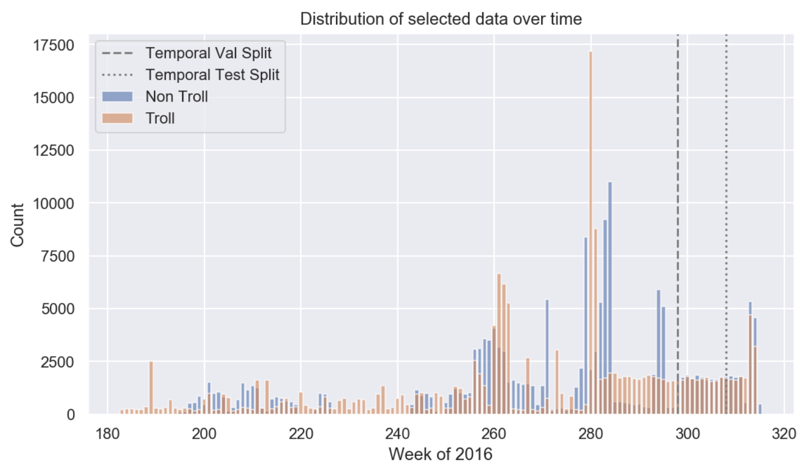
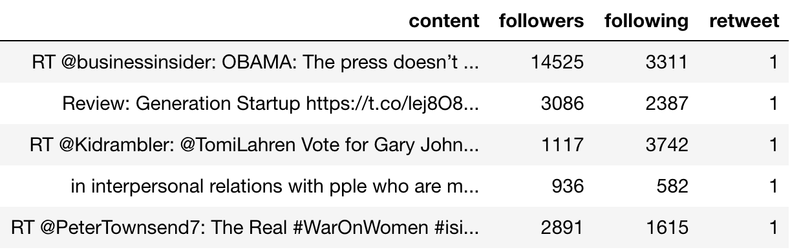
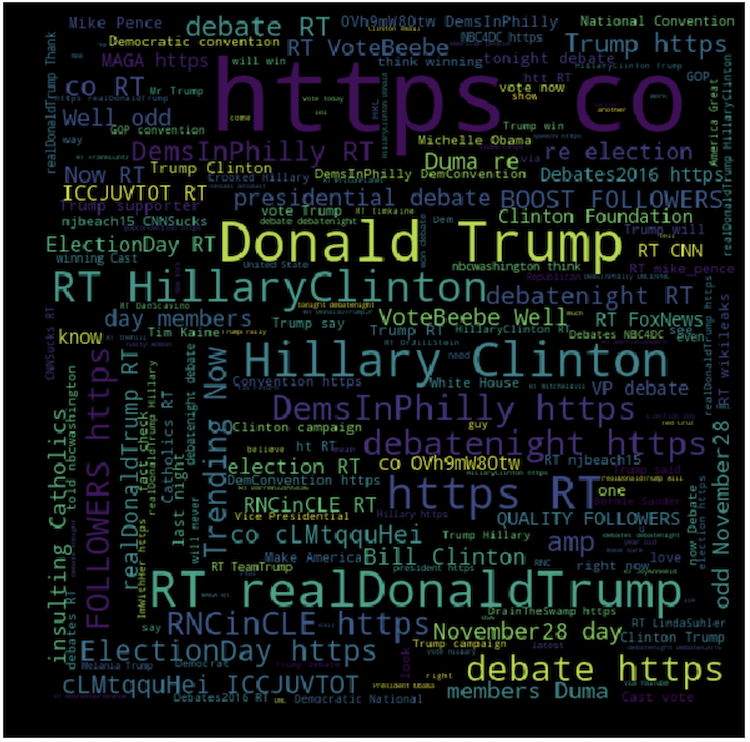
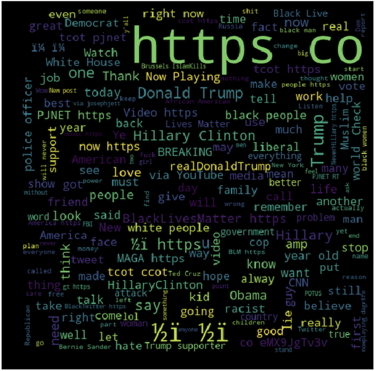

Welcome to our CS209a Project: Twitter Troll Detection!

## Group Members
- Joe Davidson
- Julien Laasri
- Abhimanyu Talwar
- Dylan Randle

## Project Statement & Objectives

### Background

We live in times of unprecedented technological advancement. Some of the greatest developments in
society and culture today are social media websites such as Facebook and Twitter. These vast online
networks are used ubiquitously around the globe for connecting with friends and sharing information.
While this undoubtedly provides a lot of positive utility in most cases, there are situations where
these unregulated social networks can be harmful. Most notably, Twitter was recently used by "troll"
agents with the aim of swaying public opinion and influencing the results of the 2016 U.S. election.

Thanks to the FiveThirtyEight organization, we have obtained a [dataset](https://github.com/fivethirtyeight/russian-troll-tweets) containing high-fidelity tweets
produced by trolls. This dataset contains nearly 3 million tweets sent from Twitter handles connected
to the Internet Research Agency (IRA), a Russian "troll factory" and a defendant in an indictment filed
by the Justice Department in February 2018, as part of special counsel Robert Mueller's Russia
investigation. The vast majority of the tweets in this dataset were posted from 2015 through 2017
(straddling the 2016 presidential election).

### Method

Using the FiveThirtyEight data as positive-troll examples, we have collected an equally large set of
tweets through various search queries (using the [Tweepy API](https://tweepy.readthedocs.io/en/v3.5.0/)) relating to the 2016 election ([here](https://dataverse.harvard.edu/dataset.xhtml?persistentId=doi%3A10.7910%2FDVN%2FPDI7IN)). We use
these data as negative-troll examples. We are well aware that this non­-troll dataset may in fact include
trolls, but these concerns are dampened by the fact that the overall population of trolls is relatively
small compared to regular users, and that Twitter actively removes tweets from troll users (resulting in
an even smaller proportion of tweets which come from trolls).

Following the results of our exploratory data analysis ([EDA](https://joeddav.github.io/troll_classification/more_eda.html)), we clean, temporally slice and stratify
our data such that the distribution of tweet post dates are approximately equal, as shown in the [cleaning](https://joeddav.github.io/troll_classification/Dataset%20Consolidation.html).
When all is said and done, the temporal distribution of the data looks as follows (roughly equal).

We select the following features to use for training: content, number of followers, number of following,
and whether or not the tweet is a retweet. An example of the features we use to train our models is shown below.

To make things more interesting, we do two different types of data splitting: random and temporal.

- Random: this is the classic train/val/test split, with completely uniform selection.

- Temporal: train on tweets before time $T$, and test on tweets after time $T$
  - By doing this, we simulate the real-life scenario where we have collected training data and wish to
    predict troll/non-troll from new data, where the distribution of topics/content may have changed over time.

In summary, the number of tweets and label proportions (% trolls) in each split are given below:

| Split Method | Train Size | Val Size | Test Size | % Trolls
| :---: | :---: | :---: | :---: |
| Random | 266003 | 33250 | 33251 | 50 |
| Temporal | 266003 | 33250 | 33251 | 66 |

As you can see, we chose the temporal split such that the dataset sizes would be equal, and this resulted in a
higher proportion of trolls (but still reasonable) in the temporal set.

### Models

The general goal in this project is to predict $P(troll|tweet)=P(y|X)$, with classification accuracy as
our measure of performance. We test three methods for representing the text component of $X$:

- Bag-of-Words (BoW)

- Term-Frequency Inverse-Document-Frequency (TF-IDF)

- Pre-trained [Semantic Sentence Embeddings](https://joeddav.github.io/troll_classification/sentence_embedding_eda.html) (from [InferSent](https://github.com/facebookresearch/InferSent))

And we fit four different models:

- Baseline [Naive Bayes](https://joeddav.github.io/troll_classification/naive_bayes.html)

- [Logistic Regression](https://joeddav.github.io/troll_classification/LogisticRegression.html)

- [Support Vector Machine](https://joeddav.github.io/troll_classification/SVM.html)

- Fully Connected [Neural Network](https://joeddav.github.io/troll_classification/TwitterNet_Sentence_Embeddings.html)

We invite you to click on the above links for an in-depth look at each of the methods we used.

### Results

Below we present the percent accuracy in classifying troll vs. non-troll. As you can see, Logistic Regression
performed the best, with the neural network coming in a close second. It is also interesting to note that the
Logistic Regression model fits the data in less than 10 seconds on a 6-core  machine, while SVM takes 40 minutes
on the same machine. On a GPU, the neural network takes roughly 3-4 minutes.

|       |  Random Split  ||  Temporal Split  ||
| Model | Train | Test | Train | Test |
|:-----:|:-----:|:----:|:-----:|:----:|
|Naive Bayes (BoW) | 0.0 | 0.0 | 0.0 | 0.0 |
|Naive Bayes (TF-IDF) | 0.0 | 0.0 | 0.0 | 0.0 |
|Logistic Regression (BoW) | 97.3 | **96.6** | 97.5 | **95.8** |
|SVM (BoW) | 0.0 | 0.0 | 0.0 | 0.0 |
|Neural Net (Embedding) | 96.4 | 96.1 | 96.5 | 95.3 |

Since Logistic Regression is an easily interpretable model (the coefficients of a feature represent the log-odds
for the predicted probability), we were able to extract the top 10 most important features in predicting
trolls and non-trolls. It is exciting that some of the features and words we identified in EDA showed up [here](https://joeddav.github.io/troll_classification/logistic_regression.html#analysis-of-coefficients).

### Conclusions

Strictly speaking, our results are quite good. We have achieved approximately $96$% accuracy in classifying trolls vs.
non-trolls using the text, number of followers, number of following, and the retweet binary flag. We are also
pleased that many of the aspects that we identified as possibly good features for classification in our EDA turned out
to be useful.

On the other hand, we must remind ourselves that what we are really classifying are *IRA* trolls. Since our data for trolls
come only from IRA Twitter handles, it is dubious for us to conclude that our models will generalize to all trolls.

But we are, ultimately, OK with this. Indeed, the term "troll" is inherently ambiguous to begin with. It is virtually impossible
to say, *for certain*, that a given tweet is trolling. As such, it really comes down to a definition of troll behavior, and
the collection of appropriate data. Given that, we have shown that we are able to classify trolls very well!

Finally, we are pleased that when we test on a temporal split of the data we still achieve high classification accuracy.
A concern of ours from the onset of this investigation was that our model might learn some underlying distribution of
topics (that are correlated with the date/time the tweet is posted at) and not what we truly cared about: trolls invariant
to the topic. Since our models do well in the case where the tweets span a new range of dates in the future, we can say
with confidence that it has learned some kind of generalization!

### Future Work

In the future, we would like to first collect more varied data related to trolls and non-trolls. In this project, we
used data relating to the 2016 U.S. presidential elections because it was available and topically relevant. However,
an extension to our models would be to see if they can predict any types of trolls with high accuracy. Furthermore,
given the success of Logistic Regression with a simple Bag-of-Words representation, it may be interesting to combine
it with the sentence embeddings from InferSent.

### Remarks

Thank you to all of the teaching staff for AC209a. We have greatly enjoyed the material and benefited immensely from
your knowledge, support, and enthusiasm for the subject.  

## Quiz

### Can you tell which word cloud comes from troll tweets?

