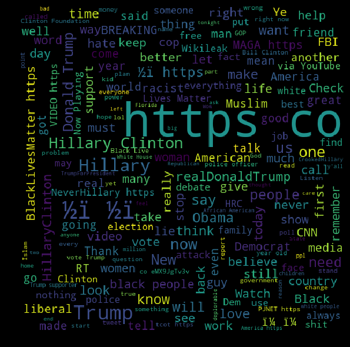
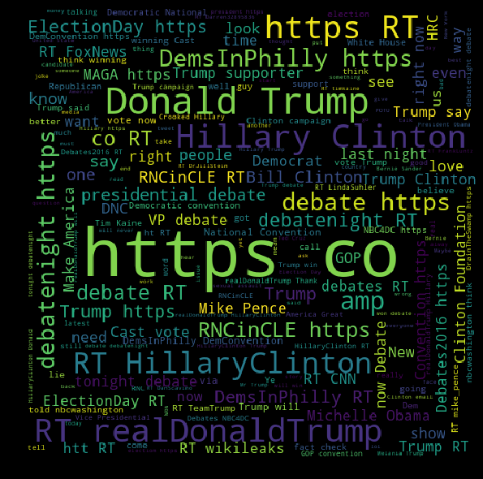

## Contents
{:.no_toc}
*  
{: toc}


# Naive Bayes

Naive Bayes is a common baseline technique for spam detection. Here, we explore how this method can be used to detect trolls solely from the text of a tweet. We first do a bit more exploration of our dataset based only on the content of the tweets. Then we try to classify trolls vs non-trolls of the common random and temporal splits that we created.

## Table of content
- <a href="#cleaning">Cleaning up the dataset</a>
- <a href="#cloud">Cloud exploration</a>
- <a href="#train">Training and testing the model</a>
- <a href="#Conclusion">Conclusion</a>

We will start with a small EDA on tweets' contents in order to show how solely the content of the tweets could potentially help us predict whether a tweet was made from a troll or not. We will start from our raw dataset that would need a bit of cleaning for this task. Then, we will do our predictions using the splits that were created specifically for predictions in our general cleaning process as they are used to compare our different models.

<div id="cleaning"></div>

## Cleaning up the dataset


```python
import pandas as pd
import seaborn as sns
import matplotlib.pyplot as plt
import numpy as np
from wordcloud import WordCloud
%matplotlib inline

from sklearn.model_selection import train_test_split
```


```python
troll_df = pd.read_csv("../data/troll_jun_to_nov_v2.csv", index_col="Unnamed: 0")
troll_df.head()
```


<div>
<style scoped>
    .dataframe tbody tr th:only-of-type {
        vertical-align: middle;
    }

    .dataframe tbody tr th {
        vertical-align: top;
    }

    .dataframe thead th {
        text-align: right;
    }
</style>
<table border="1" class="dataframe">
  <thead>
    <tr style="text-align: right;">
      <th></th>
      <th>Unnamed: 0.1</th>
      <th>external_author_id</th>
      <th>author</th>
      <th>content</th>
      <th>region</th>
      <th>language</th>
      <th>publish_date</th>
      <th>harvested_date</th>
      <th>following</th>
      <th>followers</th>
      <th>updates</th>
      <th>post_type</th>
      <th>account_type</th>
      <th>new_june_2018</th>
      <th>retweet</th>
      <th>account_category</th>
      <th>has_link</th>
    </tr>
  </thead>
  <tbody>
    <tr>
      <th>45</th>
      <td>2161</td>
      <td>1.504356e+09</td>
      <td>GALLOWAYELIANA</td>
      <td>#CharlotteUprising protests at NFL game, cuts ...</td>
      <td>United States</td>
      <td>English</td>
      <td>2016-10-05 13:48:00</td>
      <td>10/5/2016 13:49</td>
      <td>1000</td>
      <td>1148</td>
      <td>1799</td>
      <td>RETWEET</td>
      <td>left</td>
      <td>0</td>
      <td>1</td>
      <td>LeftTroll</td>
      <td>True</td>
    </tr>
    <tr>
      <th>46</th>
      <td>2162</td>
      <td>1.504356e+09</td>
      <td>GALLOWAYELIANA</td>
      <td>Gotta stay high all my life to forget I'm miss...</td>
      <td>United States</td>
      <td>English</td>
      <td>2016-10-05 13:48:00</td>
      <td>10/5/2016 13:48</td>
      <td>1000</td>
      <td>1148</td>
      <td>1798</td>
      <td>RETWEET</td>
      <td>left</td>
      <td>0</td>
      <td>1</td>
      <td>LeftTroll</td>
      <td>True</td>
    </tr>
    <tr>
      <th>47</th>
      <td>2163</td>
      <td>1.504356e+09</td>
      <td>GALLOWAYELIANA</td>
      <td>How to send the perfect demo https://t.co/3dWa...</td>
      <td>United States</td>
      <td>English</td>
      <td>2016-10-05 14:51:00</td>
      <td>10/5/2016 14:51</td>
      <td>1000</td>
      <td>1148</td>
      <td>1803</td>
      <td>RETWEET</td>
      <td>left</td>
      <td>0</td>
      <td>1</td>
      <td>LeftTroll</td>
      <td>True</td>
    </tr>
    <tr>
      <th>48</th>
      <td>2164</td>
      <td>1.504356e+09</td>
      <td>GALLOWAYELIANA</td>
      <td>Feeling superior hasn't caused an entire race ...</td>
      <td>United States</td>
      <td>English</td>
      <td>2016-10-05 14:51:00</td>
      <td>10/5/2016 14:51</td>
      <td>1000</td>
      <td>1148</td>
      <td>1801</td>
      <td>RETWEET</td>
      <td>left</td>
      <td>0</td>
      <td>1</td>
      <td>LeftTroll</td>
      <td>True</td>
    </tr>
    <tr>
      <th>49</th>
      <td>2165</td>
      <td>1.504356e+09</td>
      <td>GALLOWAYELIANA</td>
      <td>Tomm Night at UWI��� Lets do This�� ...</td>
      <td>United States</td>
      <td>English</td>
      <td>2016-10-05 14:51:00</td>
      <td>10/5/2016 14:51</td>
      <td>1000</td>
      <td>1148</td>
      <td>1802</td>
      <td>RETWEET</td>
      <td>left</td>
      <td>0</td>
      <td>1</td>
      <td>LeftTroll</td>
      <td>True</td>
    </tr>
  </tbody>
</table>
</div>


```python
del troll_df["Unnamed: 0.1"]
```


The techniques that we'll use highly depends on the language that we are dealing with, so we'll only keep English. By doing so we won't get rid of too many samples as most of the tweets we have in our dataset are in English:


```python
troll_df.language.value_counts()
```


    English               166252
    French                   321
    Spanish                  207
    Vietnamese               188
    Italian                  174
    Dutch                    100
    German                    97
    Portuguese                80
    Arabic                    72
    Norwegian                 63
    Romanian                  57
    Estonian                  51
    Swedish                   44
    Albanian                  41
    Farsi (Persian)           37
    Japanese                  31
    Catalan                   30
    Croatian                  30
    Uzbek                     28
    Polish                    22
    Lithuanian                22
    LANGUAGE UNDEFINED        19
    Hindi                     17
    Icelandic                 16
    Turkish                   13
    Hungarian                 12
    Kurdish                   11
    Russian                   10
    Somali                     9
    Finnish                    9
    Tagalog (Filipino)         9
    Danish                     8
    Indonesian                 6
    Slovenian                  6
    Bulgarian                  6
    Czech                      6
    Latvian                    5
    Malay                      4
    Urdu                       3
    Ukrainian                  3
    Greek                      2
    Korean                     2
    Hebrew                     2
    Slovak                     2
    Name: language, dtype: int64


```python
troll_df = troll_df[troll_df.language == 'English']
```


We manually add a label to say that these tweets are troll tweets.


```python
troll_df["is_troll"] = 1
```


```python
non_troll_df = pd.read_json("../data/non_troll_data_simplified_v4.json")
non_troll_df.head()
```


<div>
<style scoped>
    .dataframe tbody tr th:only-of-type {
        vertical-align: middle;
    }

    .dataframe tbody tr th {
        vertical-align: top;
    }

    .dataframe thead th {
        text-align: right;
    }
</style>
<table border="1" class="dataframe">
  <thead>
    <tr style="text-align: right;">
      <th></th>
      <th>index</th>
      <th>created_at</th>
      <th>id</th>
      <th>is_quote_status</th>
      <th>lang</th>
      <th>possibly_sensitive</th>
      <th>retweet_count</th>
      <th>retweeted</th>
      <th>scopes</th>
      <th>source</th>
      <th>text</th>
      <th>truncated</th>
      <th>withheld_in_countries</th>
      <th>followers</th>
      <th>following</th>
      <th>is_a_retweet</th>
      <th>has_link</th>
    </tr>
  </thead>
  <tbody>
    <tr>
      <th>0</th>
      <td>603148</td>
      <td>2016-11-08 16:58:18</td>
      <td>796034121906745344</td>
      <td>False</td>
      <td>en</td>
      <td>0.0</td>
      <td>50924</td>
      <td>False</td>
      <td>None</td>
      <td>&lt;a href="http://twitter.com/download/iphone" r...</td>
      <td>RT @HillaryClinton: Don't stand still. Vote to...</td>
      <td>False</td>
      <td>None</td>
      <td>387</td>
      <td>359</td>
      <td>True</td>
      <td>True</td>
    </tr>
    <tr>
      <th>1</th>
      <td>603149</td>
      <td>2016-11-08 22:34:35</td>
      <td>796118750059700224</td>
      <td>False</td>
      <td>es</td>
      <td>0.0</td>
      <td>229</td>
      <td>False</td>
      <td>None</td>
      <td>&lt;a href="http://twitter.com" rel="nofollow"&gt;Tw...</td>
      <td>RT @Javierito321: Yo si gana Trump / Yo si gan...</td>
      <td>False</td>
      <td>None</td>
      <td>685</td>
      <td>949</td>
      <td>True</td>
      <td>True</td>
    </tr>
    <tr>
      <th>10</th>
      <td>603158</td>
      <td>2016-11-09 03:40:03</td>
      <td>796195620541243392</td>
      <td>True</td>
      <td>en</td>
      <td>0.0</td>
      <td>0</td>
      <td>False</td>
      <td>None</td>
      <td>&lt;a href="http://twitter.com/download/iphone" r...</td>
      <td>THANK GOD https://t.co/XKSWHg133c</td>
      <td>False</td>
      <td>None</td>
      <td>131</td>
      <td>33</td>
      <td>False</td>
      <td>True</td>
    </tr>
    <tr>
      <th>100</th>
      <td>603248</td>
      <td>2016-11-09 02:28:06</td>
      <td>796177513613402112</td>
      <td>False</td>
      <td>en</td>
      <td>0.0</td>
      <td>12809</td>
      <td>False</td>
      <td>None</td>
      <td>&lt;a href="http://twitter.com/download/iphone" r...</td>
      <td>RT @J4CKMULL: Hillary Clinton really did the #...</td>
      <td>False</td>
      <td>None</td>
      <td>338</td>
      <td>315</td>
      <td>True</td>
      <td>True</td>
    </tr>
    <tr>
      <th>1000</th>
      <td>604148</td>
      <td>2016-11-08 13:46:47</td>
      <td>795985921342640128</td>
      <td>True</td>
      <td>en</td>
      <td>NaN</td>
      <td>1</td>
      <td>False</td>
      <td>None</td>
      <td>&lt;a href="http://twitter.com/download/iphone" r...</td>
      <td>RT @OthewhomaniT: #ElectionDay\nRaise your han...</td>
      <td>False</td>
      <td>None</td>
      <td>2245</td>
      <td>1633</td>
      <td>True</td>
      <td>False</td>
    </tr>
  </tbody>
</table>
</div>


We manually put a label to say that these tweets are trolls.


```python
non_troll_df["is_troll"] = 0
```


```python
non_troll_df = non_troll_df.rename(columns={"text": "content"})
```


```python
non_troll_df.lang.value_counts()
```


    en     962426
    und     39316
    es      27108
    fr       6544
    pt       2868
    it       2427
    de       2198
    in       1332
    tr       1015
    nl        971
    ar        931
    tl        914
    ja        910
    ht        571
    ca        444
    th        395
    pl        386
    sv        382
    ru        254
    da        246
    et        244
    ro        234
    hi        201
    el        179
    ko        136
    no        135
    cy        134
    cs         97
    fi         91
    fa         85
    vi         79
    eu         72
    zh         65
    ur         58
    lt         56
    hu         46
    lv         34
    sl         33
    iw         32
    is         31
    uk         20
    ne         12
    ta         10
    bn          5
    sr          5
    ml          4
    mr          3
    am          2
    te          2
    si          2
    ka          1
    bg          1
    Name: lang, dtype: int64


English seems to be way less dominant in this dataset than in the troll one, let's verify that the few dominant languages are correct.


```python
non_troll_df[non_troll_df.lang == 'en'].sample(10).content
```


    924027     Only 43 Days until #Trump CHILD RAPE case goes...
    753238     RT @deray: Donald Trump embodies white male pr...
    839581     Trump supporters don't support Clinton because...
    533899     RT @JLownLaw: .@HillaryClinton not only won th...
    1016435    RT @realDonaldTrump: Join the MOVEMENT to #MAG...
    871188     RT @billmaher: Final thought: Hillary won the ...
    466613     RT @ayeeyoslim: You mean Michelle Obama's spee...
    357131     Entertainment News: Trump Again Attacks Former...
    980586     RT @Jeff_Jacoby: Chris Wallace: "In a speech y...
    174991     @xychromey What crimes has Hillary committed? ...
    Name: content, dtype: object


`und` is used when the language was not automatically detected. These tweets generally only have hashtags or @ mentions. To make sure that we do not pick up non-english hashtags and @ mentions, we'll get rid of this category.


```python
non_troll_df[non_troll_df.lang == 'und'].sample(10).content
```


    1052881                                            😂 #debate
    288156     #ImWithHer #debatenight #debates @HillaryClint...
    38963                              😂 https://t.co/1VVs9lGwR1
    782740     RT @TeamTrump: 👀 #TrumpGameday https://t.co/jZ...
    567559                #DemsInPhilly  https://t.co/GZaqtlvk7g
    783274         #debatenight #Notrump https://t.co/DwPOle8ztw
    44605      #ElectionDay #myvote2016 #voted #ObamaDay #Pos...
    896070     @misguidedangel9 @KatyTurNBC @realDonaldTrump ...
    400732                         👇🏿👇🏿👎 https://t.co/HKlP8j0LwW
    927525                               https://t.co/OzbFNZk5fi
    Name: content, dtype: object


```python
non_troll_df[non_troll_df.lang == 'es'].sample(10).content
```


    228737    RT @VidaModernaSER: Hicimos a Lopetegui selecc...
    760609    No todos juegan en la misma cancha,  @CarlosLo...
    890537    RT @MALCOM_X_: Asesor principal de Hillary Cli...
    219152    RT Univ_Mundo: No te pierdas #TertuliaHillaryv...
    34488        RT @janestylxs94: #ElectionDay \n\nVOTEN GENTE
    802547    La esperanza es que Mike Pence se marque un #u...
    42071     Dónde hay un Lee Harvey Oswald cuando hace fal...
    530597                     @realDonaldTrump ERES UN PUTO!!!
    802887    RT @etapiamarquez: Después de estar meses sigu...
    9833      RT @sofiastark: Prefiero pensar que los intere...
    Name: content, dtype: object


```python
non_troll_df[non_troll_df.lang == 'fr'].sample(10).content
```


    130076    RT @deray: Michelle. #DemConvention https://t....
    858348    RT @hdstanton1: La propagande jusqu'à l'overdo...
    799709         Dite moi que c'est une blague ? #ElectionDay
    110680    RT @f_philippot: Urgence de mettre sur la tabl...
    325746    J'aime une vidéo @YouTube : "Attaques de Trump...
    844401    #Estrosi condamne les propos de #Poisson sur #...
    337867    @20Minutes : Hollande le nul, donne un avis su...
    44013     C'est chaud là les élections américaines..... ...
    106615    RT @Ninjavlito: Lé ricain pr tué un ptit renoi...
    346455    RT @LePoint: Pour #Obama, #Trump n'est "pas qu...
    Name: content, dtype: object


Languages seem to be correct, we'll only keep English once again.


```python
non_troll_df = non_troll_df[non_troll_df.lang == 'en']
```


We can make the classes even, that would allow us to go through the dataset much faster as there are more non-troll tweets than needed at the moment.


```python
print("There are {} observations in the troll dataset.".format(troll_df.shape[0]))
print("There are {} observations in the non-troll dataset.".format(non_troll_df.shape[0]))
```


    There are 166252 observations in the troll dataset.
    There are 962426 observations in the non-troll dataset.


We will randomly downsample the non-troll dataset to have the same number of tweets in each category.


```python
non_troll_df_undersampled = non_troll_df.sample(n=troll_df.shape[0], random_state=123)
```


```python
print("There are {} observations in the troll dataset.".format(troll_df.shape[0]))
print("There are {} observatins in the non-troll undersampled dataset.".format(non_troll_df_undersampled.shape[0]))
```


    There are 166252 observations in the troll dataset.
    There are 166252 observatins in the non-troll undersampled dataset.


```python
full_df = pd.concat((troll_df[["content", "is_troll"]],
                     non_troll_df_undersampled[["content", "is_troll"]]))
```


```python
full_df.is_troll.value_counts()
```


    1    166252
    0    166252
    Name: is_troll, dtype: int64


```python
full_df.head()
```


<div>
<style scoped>
    .dataframe tbody tr th:only-of-type {
        vertical-align: middle;
    }

    .dataframe tbody tr th {
        vertical-align: top;
    }

    .dataframe thead th {
        text-align: right;
    }
</style>
<table border="1" class="dataframe">
  <thead>
    <tr style="text-align: right;">
      <th></th>
      <th>content</th>
      <th>is_troll</th>
    </tr>
  </thead>
  <tbody>
    <tr>
      <th>45</th>
      <td>#CharlotteUprising protests at NFL game, cuts ...</td>
      <td>1</td>
    </tr>
    <tr>
      <th>46</th>
      <td>Gotta stay high all my life to forget I'm miss...</td>
      <td>1</td>
    </tr>
    <tr>
      <th>47</th>
      <td>How to send the perfect demo https://t.co/3dWa...</td>
      <td>1</td>
    </tr>
    <tr>
      <th>48</th>
      <td>Feeling superior hasn't caused an entire race ...</td>
      <td>1</td>
    </tr>
    <tr>
      <th>49</th>
      <td>Tomm Night at UWI��� Lets do This�� ...</td>
      <td>1</td>
    </tr>
  </tbody>
</table>
</div>


Let's clean up the indexes of the full dataset.


```python
full_df.reset_index(drop=True, inplace=True)
```


```python
full_df.head()
```


<div>
<style scoped>
    .dataframe tbody tr th:only-of-type {
        vertical-align: middle;
    }

    .dataframe tbody tr th {
        vertical-align: top;
    }

    .dataframe thead th {
        text-align: right;
    }
</style>
<table border="1" class="dataframe">
  <thead>
    <tr style="text-align: right;">
      <th></th>
      <th>content</th>
      <th>is_troll</th>
    </tr>
  </thead>
  <tbody>
    <tr>
      <th>0</th>
      <td>#CharlotteUprising protests at NFL game, cuts ...</td>
      <td>1</td>
    </tr>
    <tr>
      <th>1</th>
      <td>Gotta stay high all my life to forget I'm miss...</td>
      <td>1</td>
    </tr>
    <tr>
      <th>2</th>
      <td>How to send the perfect demo https://t.co/3dWa...</td>
      <td>1</td>
    </tr>
    <tr>
      <th>3</th>
      <td>Feeling superior hasn't caused an entire race ...</td>
      <td>1</td>
    </tr>
    <tr>
      <th>4</th>
      <td>Tomm Night at UWI��� Lets do This�� ...</td>
      <td>1</td>
    </tr>
  </tbody>
</table>
</div>


<div id="cloud"></div>

## Cloud exploration


```python
def create_word_cloud(full_df, troll_label):
    words = ' '.join(full_df[full_df.is_troll == troll_label].content.values)
    wc = WordCloud(width = 512,height = 512).generate(words)
    plt.figure(figsize = (10, 8), facecolor = 'k')
    plt.imshow(wc)
    plt.axis('off')
    plt.tight_layout(pad = 0)
    plt.show()
```


Let's see which words are more popular within the troll dataset.


```python
%%time
create_word_cloud(full_df, troll_label=1)
```





    Wall time: 11 s


Now with the non-troll dataset.


```python
%%time
create_word_cloud(full_df, troll_label=0)
```





    Wall time: 10.3 s


These word clouds reveal at least two things on the differences of the two datasets:
 - Racial-related tweets seem to be way more present in troll tweets than in non-troll tweets: "Black", "White", "African American", "BlackLivesMatter", "black people" are easily noticeable in the troll cloud whereas they seem completely absent of the non-troll cloud.
 - The non-troll tweets seem much more factual, generally mentioning big events (e.g. Debate Night, Election Day) or candidates (e.g. Donald Trump, Hillary Clinon). On the contrary, words like "police", "women", "Muslim", and "racist" that can easily be found in the troll word cloud may remind us of touchy controversies that happened during the presidential elections.

Let's see to what they actually refer to on some example troll tweets.


```python
def show_tweets_about(dataframe, subject, max_num=10):
    for i, tweet in enumerate(dataframe.content[dataframe.content.apply(lambda x: subject in x)][:max_num], 1):
        print(i, tweet)
```


```python
touchy_subjects = ["police", "women", "Muslim", "racist"]
```


```python
for subject in touchy_subjects:
    print("##### Subject: {}".format(subject))
    show_tweets_about(troll_df, subject)
    print("\n")
```


    ##### Subject: police
    1 LRT: The Chicago police ARE a criminal gang.
    2 Newark police killed two black teenagers this past Saturday  https://t.co/hR4fj5VGOj https://t.co/7H2z6EZeoB
    3 You'll hear police asking for "respect",men demanding "respect", because demanding submission and obedience reveals the means of domination
    4 4-6 armed men have stormed a police training center in #Quetta, #Pakistan & 200 cadets hostages � https://t.co/XAAYrvbSzX via @metesohtaoglu
    5 Social justice warriors have vowed to call the police on people wearing “offensive” Halloween costumes. Yes, really. https://t.co/odrRcouV7S
    6 Twice now CNN has deceptively edited video to present a particular narrative of police shootings —>  https://t.co/1H6OQT98Yx
    7 2 police officers shot in San Diego and all #BlackLivesMatter members keep silent Don't their lifes matter? https://t.co/2QjpLSPpQG
    8 The police worried about "gang" violence when they are the only "gang" being violent
    9 Suspect in Boston police shooting is dead, police commissioner says - FOX25 News via @breaking  https://t.co/3xvc3yRw1s
    10 "If you want to build trust in African-American communities, hold police officers accountable" #DeborahDanner #BlackLivesMatter https://t.co/XgFWuRHzc3


    ##### Subject: women
    1 What the fuck does this headline even mean? Can women be "trusted"? Fuck this society man. https://t.co/i8PBR5EZcp
    2 We need to cite women more! #ASALH2016
    3 Too few women at the top means we are all losing out \| Jane Dudman https://t.co/5pfxgoVhZg
    4 Dems do the same. Sex-shaming of women Body-shaming of women Those are bipartisan efforts https://t.co/QLdpRRpbAu
    5 Mamie Till.  One of the Strongest women in history EVER.  Put her on a T-Shirt.  https://t.co/RUiQINGLZr
    6 ICYMI: Solange Knowles perfectly explained the problem black women face in "white spaces" https://t.co/tfvMDbJ24n https://t.co/8qSaSqZEh0
    7 Trump rally in #Cincinnati: notice this ladies shirt 'Hey Trump Talk Dirty To Me'  It seems like women still love Trump� #WhyWomenDontReport https://t.co/qh1YbsJrNO
    8 Look at the gender gap!  Men believe the accusations by 44-37 (+7), but women believe them by 56-26 (+30) ! https://t.co/8T3h1NzZPV
    9 '@DMashak @MileyCyrus @HillaryClinton her damn loud mouth and giant disgusting tongue hanging out all the time OFFENDS & demeans women'
    10 #IStandWIthMegynKelly  GOP better wake up -- women are dumping GOP by the thousands every day! https://t.co/tZHMeenrkZ


    ##### Subject: Muslim
    1 Report shows NYPD violated court-mandated rules when investigating Muslim groups. #IntelGroup  https://t.co/e61DhUdaYp
    2 4 Million Muslims Killed In Western Wars: Should We Call It Genocide? - https://t.co/DsQ6gmQLX0 https://t.co/c32WLkY555
    3 #ImWithHer THINK LONG & HARD! Muslim #Refugees Getting FREE APARTMENTS While #Homeless Citizens DIE IN THE STREETS   https://t.co/rZXeuwkvaa
    4 MT @bcwilliams92: Look Son.... Another Terror Attack By Peaceful Muslims! #WakeUpAmerica https://t.co/dzS7J9B9VZ #PJNET
    5 In a #Muslim country, a group of males assault a girl just because of her dress. This is coming to you, Westerners. https://t.co/MDLeao8P0g
    6 "Brother is tortured and forced to listen to his sister, 17, being gang-raped...by Pakistani Muslim...Christianity" https://t.co/HjhpBqNpqs
    7 VIDEO: Muslim Migrant Jihad Shooting Rampage at Washington State Mall https://t.co/i94eEKsVx2 via @BradleeDean1
    8 Muslims in U.S. after Trump victory: “I fear for my Muslim family” https://t.co/DrLEDgvdqi https://t.co/d60IL0eFzJ
    9 Somali Muslims harass an American citizen walking on the streets of Minnesota. @PRyan brought these "refugees" in. https://t.co/035czvQLuP
    10 Chelsea Islamist Bomber Ahmad Rahami Sued Police in 2011 for Profiling Muslims https://t.co/9l52I8djoK


    ##### Subject: racist
    1 U post links to racist sites, then claim u don't read those same sites, & expect respect? Why? @jimmystevens506 https://t.co/GUm4KQYe32
    2 "Obamacare will be a disaster" "Shut up, racist!"  4 years later: "Obamacare's a disaster" "Help us fix it, racist?"
    3 ENOUGH! 642,000 crimes against Texans by ILLEGAL IMMIGRANTS in 8 years! Don't you DARE call me racist for wanting to protect my kids! #Trump
    4 Donald Trump can't stop himself from lashing out and calls Hillary Clinton a "nasty woman." #Trump left out evil & racists. https://t.co/zdZLEV49nw
    5 U confused why racists shouldn't quote MLK in attempts to silence ppl of color? What's confusing? @josephescobedo4 https://t.co/5vEqAHFMs4
    6 And Trump is a virulent racist who is empowered by white supremacist KKK lovers like u @alphakilla https://t.co/TN8KL8xf2V
    7 NBA ownership is 99% white. So yes, the NBA is very racist. https://t.co/87YoGzhmSo
    8 There ARE consultants, managers, and executives committed to creating equitable,anti-racist workplaces.  Instead of "handling" PoC.
    9 �� #WakeUpAmerica   #DonaldTrump isn't a racist. He wants to stop Radical Islamic Terrorism & make us safe.   #MakeAmericaGreatAgain https://t.co/fnaDlumQAP
    10 Red plastic flowers are now racist, because Brexit or something. https://t.co/sntHzidQSl


These indeed usually refer to touchy subjects.

<div id="train"></div>

## Training and testing the model

Let's use the common train and test splits that we have created to be used for our model-based predictions. This data was cleaned in the same way that we did above and can thus directly be used to do predictions.


```python
in_file = '../data/merged_troll_data.json'
data_df = pd.read_json(in_file)
```


```python
# Read the indices file
index_file = '../data/train_test_inds.json'
idx_df = pd.read_json(index_file)
```


```python
def get_train_test(mode):
    """We combine valid and train into the same dataset."""
    train_df = data_df.iloc[idx_df[mode]["train"]]
    valid_df = data_df.iloc[idx_df[mode]["val"]]
    test_df = data_df.iloc[idx_df[mode]["test"]]
    return pd.concat((train_df, valid_df)), test_df
```


```python
from collections import Counter
from sklearn import feature_extraction, model_selection, naive_bayes, metrics, svm
from sklearn.metrics import accuracy_score
from sklearn.model_selection import cross_val_score
```


```python
def naive_bayes_classification(mode, feature_extractor, alphas=None):

    if alphas is None:
        alphas = [i/10 for i in range(1, 11)]

    print("Loading {} split...".format(mode))
    train_df, test_df = get_train_test(mode)

    print("Applying and fitting transform...")
    x_train = feature_extractor.fit_transform(train_df["content"])
    y_train = train_df["troll"]

    x_test = feature_extractor.transform(test_df["content"])
    y_test = test_df["troll"]

    print("Performing cross-validation to find best alpha from {}".format(alphas))
    # We perform cross-validation to get the best regularization parameter
    alpha_scores = []
    for alpha in alphas:
        scores = cross_val_score(naive_bayes.MultinomialNB(alpha=alpha), x_train, y_train, cv=5)
        mean_score = np.mean(scores)
        print("Cross-validation accuracy for alpha={} is {}".format(alpha, mean_score))
        alpha_scores.append((alpha, mean_score))
    best_alpha, best_score = max(alpha_scores, key=lambda x: x[1])
    print("Best score {} was obtained with alpha={}".format(best_score, best_alpha))
    print("Retraining the model on the whole training set...")
    best_model = naive_bayes.MultinomialNB(alpha=best_alpha).fit(x_train, y_train)
    print("Train score of best model is {}".format(best_model.score(x_train, y_train)))
    print("Test score of best model is {}".format(best_model.score(x_test, y_test)))
```


### Naive Bayes using Bag-Of-Words

Let's see how Naive Bayes performs on our random split.


```python
%%time
naive_bayes_classification(mode="random", feature_extractor=feature_extraction.text.CountVectorizer(stop_words='english'))
```


    Loading random split...
    Applying and fitting transform...
    Performing cross-validation to find best alpha from [0.1, 0.2, 0.3, 0.4, 0.5, 0.6, 0.7, 0.8, 0.9, 1.0]
    Cross-validation accuracy for alpha=0.1 is 0.8806394585407122
    Cross-validation accuracy for alpha=0.2 is 0.8806260915113493
    Cross-validation accuracy for alpha=0.3 is 0.8805492337585061
    Cross-validation accuracy for alpha=0.4 is 0.8800580136165905
    Cross-validation accuracy for alpha=0.5 is 0.8797338727156644
    Cross-validation accuracy for alpha=0.6 is 0.879182499406172
    Cross-validation accuracy for alpha=0.7 is 0.8787714759688743
    Cross-validation accuracy for alpha=0.8 is 0.8783470848322121
    Cross-validation accuracy for alpha=0.9 is 0.8779494269726509
    Cross-validation accuracy for alpha=1.0 is 0.8776319711218104
    Best score 0.8806394585407122 was obtained with alpha=0.1
    Retraining the model on the whole training set...
    Train score of best model is 0.9596963104797612
    Test score of best model is 0.8808456888514631
    Wall time: 15.4 s


Let's see how Naive Bayes performs on our temporal split.


```python
%%time
naive_bayes_classification(mode="temporal", feature_extractor=feature_extraction.text.CountVectorizer(stop_words='english'))
```


    Loading temporal split...
    Applying and fitting transform...
    Performing cross-validation to find best alpha from [0.1, 0.2, 0.3, 0.4, 0.5, 0.6, 0.7, 0.8, 0.9, 1.0]
    Cross-validation accuracy for alpha=0.1 is 0.8779493997953454
    Cross-validation accuracy for alpha=0.2 is 0.8782635127302421
    Cross-validation accuracy for alpha=0.3 is 0.878206702255184
    Cross-validation accuracy for alpha=0.4 is 0.8777555770598072
    Cross-validation accuracy for alpha=0.5 is 0.877471535013705
    Cross-validation accuracy for alpha=0.6 is 0.8769769708951556
    Cross-validation accuracy for alpha=0.7 is 0.8762785657900913
    Cross-validation accuracy for alpha=0.8 is 0.875733876302425
    Cross-validation accuracy for alpha=0.9 is 0.8750855946681405
    Cross-validation accuracy for alpha=1.0 is 0.8746144233116248
    Best score 0.8782635127302421 was obtained with alpha=0.2
    Retraining the model on the whole training set...
    Train score of best model is 0.9530363939542795
    Test score of best model is 0.84355357733602
    Wall time: 15.1 s


### Naive Bayes using TF-IDF

We do the same comparison using TF-IDF:
For our random split, we obtain:


```python
%%time
naive_bayes_classification(mode="random", feature_extractor=feature_extraction.text.TfidfVectorizer(stop_words='english'))
```


    Loading random split...
    Applying and fitting transform...
    Performing cross-validation to find best alpha from [0.1, 0.2, 0.3, 0.4, 0.5, 0.6, 0.7, 0.8, 0.9, 1.0]
    Cross-validation accuracy for alpha=0.1 is 0.8541367975925074
    Cross-validation accuracy for alpha=0.2 is 0.8545043804315989
    Cross-validation accuracy for alpha=0.3 is 0.854420843937751
    Cross-validation accuracy for alpha=0.4 is 0.8538293713826175
    Cross-validation accuracy for alpha=0.5 is 0.8531710650206208
    Cross-validation accuracy for alpha=0.6 is 0.8526330586846915
    Cross-validation accuracy for alpha=0.7 is 0.85194133667549
    Cross-validation accuracy for alpha=0.8 is 0.8514066720829071
    Cross-validation accuracy for alpha=0.9 is 0.8507149497945514
    Cross-validation accuracy for alpha=1.0 is 0.850170260697654
    Best score 0.8545043804315989 was obtained with alpha=0.2
    Retraining the model on the whole training set...
    Train score of best model is 0.9504967368748183
    Test score of best model is 0.8577787134221527
    Wall time: 15.1 s


On our temporal split:


```python
%%time
naive_bayes_classification(mode="temporal", feature_extractor=feature_extraction.text.TfidfVectorizer(stop_words='english'))
```


    Loading temporal split...
    Applying and fitting transform...
    Performing cross-validation to find best alpha from [0.1, 0.2, 0.3, 0.4, 0.5, 0.6, 0.7, 0.8, 0.9, 1.0]
    Cross-validation accuracy for alpha=0.1 is 0.8492746631020361
    Cross-validation accuracy for alpha=0.2 is 0.848860295018064
    Cross-validation accuracy for alpha=0.3 is 0.8482621418237356
    Cross-validation accuracy for alpha=0.4 is 0.8469321615679775
    Cross-validation accuracy for alpha=0.5 is 0.845378292657063
    Cross-validation accuracy for alpha=0.6 is 0.8436172414070826
    Cross-validation accuracy for alpha=0.7 is 0.8421535971109095
    Cross-validation accuracy for alpha=0.8 is 0.8405095052044238
    Cross-validation accuracy for alpha=0.9 is 0.8388453616092886
    Cross-validation accuracy for alpha=1.0 is 0.8372447100218118
    Best score 0.8492746631020361 was obtained with alpha=0.1
    Retraining the model on the whole training set...
    Train score of best model is 0.9599937176903823
    Test score of best model is 0.8026224775194731
    Wall time: 15.5 s


## Conclusion

Unfortunately, it seems that Naive Bayes significantly overfits on the training set despite the regularization parameter and the usage of cross-validation. This shows the need to use other types of models that would allow us the usage of more regularization techniques.
