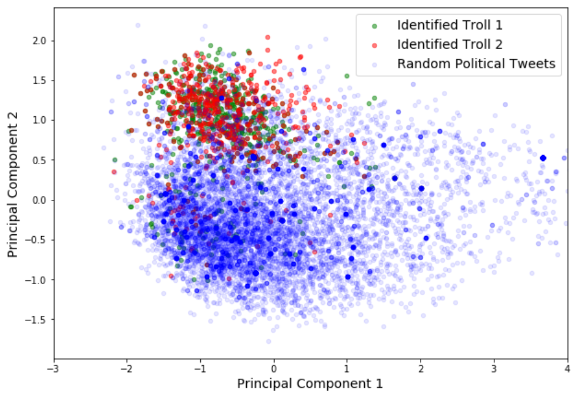
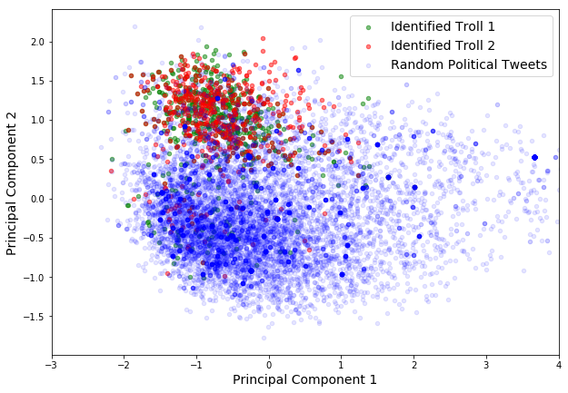

## Contents
{:.no_toc}
*  
{: toc}


# Summary
This notebook contains code for our preliminary EDA using sentence embeddings. We have used Facebook's InferSent for encoding Tweets into sentence embedding vectors of length $4,096$. For our analysis we considered about ~11k political themed tweets from 2016-2017, and converted them into embeddings. We did the same for ~1000 tweets from two identifed troll accounts. We then plotted the first two principal components of the tweet embeddings (see Figure 1 below), and identified that:

* Tweets from each troll were clustered together among the scatter plot of principal components.
* More importantly, the clusters of both trolls occupied the same location in the scatter plot.


**Fig. 1: First Two Principal Components of Sentence Embeddings of two Confirmed Trolls and ~10k other political tweets**


## Code use for our Sentence Embeddings EDA


```python
# import stuff
%load_ext autoreload
%autoreload 2
%matplotlib inline

from random import randint

import numpy as np
import torch
import json
import pandas as pd
import glob
import os

import tweepy
import sys
import jsonpickle
```


```python
api_key = '02GS3Mo7IkbOZzHlkjMVXLaxh'
api_secret = '50o182mornUFvpVJU36ij9zueUvfQMPOa3wz8jabYbzw3cIEyO'
# Replace the API_KEY and API_SECRET with your application's key and secret.
auth = tweepy.AppAuthHandler(api_key, api_secret)

api = tweepy.API(auth, wait_on_rate_limit=True, wait_on_rate_limit_notify=True)

if (not api):
    print ("Can't Authenticate")
    sys.exit(-1)
```


```python
#!pwd
troll_dir = '~/Documents/Coding/Harvard/ac209a_abhimanyu_talwar/content/projects/Twitter/data/russian-troll-tweets/'
main_dir = 'C:/Users/Abhimanyu/Documents/Coding/Harvard/ac209a_abhimanyu_talwar/content/projects/Twitter/data'
```


```python
all_file = 'first-debate.txt'
all_ids = []
with open(os.path.join(main_dir, all_file), 'r') as f:
    all_ids = f.read().splitlines()
len(all_ids)
```


    3183202


```python
def getTweetsByID(tweet_ids):
    count = len(tweet_ids)
    result = []
    for i in range(int(count/100) + 1):
        try:
            tmp = api.statuses_lookup(tweet_ids[i*100:(i+1)*100])
            result += tmp
        except tweepy.TweepError:
            continue
    print('Downloaded {} tweets.'.format(len(result)))
    return result

def getTextFromStatus(status_list):
    result = [s.text for s in status_list]
    return result
```


```python
num_tweets = 15000
tweet_ids = list(np.array(all_ids)[np.random.choice(np.arange(len(all_ids)), size=num_tweets, replace=False)])
result = getTweetsByID(tweet_ids)
```


    Downloaded 10131 tweets.


```python
random_tweets = getTextFromStatus(result)
```


```python
allFiles = [troll_dir + "/IRAhandle_tweets_10.csv"]
list_ = []
for file_ in allFiles:
    df = pd.read_csv(file_)
    list_.append(df)
data = pd.concat(list_)
```


    C:\Users\Abhimanyu\Miniconda3\envs\pytorch\lib\site-packages\IPython\core\interactiveshell.py:2785: DtypeWarning: Columns (20) have mixed types. Specify dtype option on import or set low_memory=False.
      interactivity=interactivity, compiler=compiler, result=result)


```python
data.shape
```


    (243891, 21)


```python
data.columns
```


    Index(['external_author_id', 'author', 'content', 'region', 'language',
           'publish_date', 'harvested_date', 'following', 'followers', 'updates',
           'post_type', 'account_type', 'retweet', 'account_category',
           'new_june_2018', 'alt_external_id', 'tweet_id', 'article_url',
           'tco1_step1', 'tco2_step1', 'tco3_step1'],
          dtype='object')


In the following few lines, I am sorting Twitter users by number of tweets in our dataset. This is so that I can choose two users with sufficient amount of tweets for an analysis.


```python
num_per_user = [np.sum(data['author'] == x) for x in data['author'].unique()]
```


```python
indices = np.argsort(-np.array(num_per_user))
```


```python
idx_list = indices[(np.array(num_per_user)[indices] > 400) & (np.array(num_per_user)[indices] < 700)]
```


```python
data['author'].unique()[idx_list]
```


    array(['ANOSSOVV', 'ARGENTINACATLE1', 'ANGTHEESTR', 'ANDEERLWR',
           'ARTYRTOLSTOV', 'ANATOLINEMCOV', '5EMEN5EMENICH', 'ASHLEEYWES',
           'ARTUR__2014', 'ANNIJONSTR', 'AGATA_ALEXEEVA', 'ANGISDOOYL',
           'AHNORDYK', 'ACAPARELLA', 'ANYA_ISA1282', 'ANISACRRUTR',
           'ANTONFROMSPB', 'ANTONRUMSS', 'AAAVADAKEDAVRAA', 'ANJELICAFAMOUS',
           'ANDRREETRT', 'ANORAVERD', 'ANNY_DUBI', 'ARKHIPOVICHIVNA',
           'ABMERRLINS', 'ALINALINKI_', 'ARINA_RONDAL', 'ARONS_KWENDE',
           'ANTYSHEVALIDA', 'ALINANOVIKOV022', 'AAGN1AA', 'ANDRIYCCCP',
           'ALISONDAVOL', 'ANDREBAKIN', 'ANASTASIAR777', 'ALTMANCOON',
           'ALENAZELDINA', 'ARESTOVEVG', 'ANGELINADARCY_', 'ANGELIKOROTKOVA',
           'ANN__BOGDANOVA', 'ALISA_FRATKINA', 'ALINAVIATKOVA',
           'ANGELIKAMUSI', 'ANGELINALADOVA', 'ANNA_VYSOKAYA', 'ALLAHOMORE',
           '5L5_5L5', 'AFONINMIXAIL', 'ANFISAMICKEY', 'AFRICAVSERDCE',
           'ABALAKOVAYLIA', 'AFONIA_ZHILCOV', 'ANBIVALENTNAYA',
           'ALEXXBELYAEV', 'ARISGRAYS', 'AMERICANALBERT', 'ARTEMMPLOTNIKOV',
           'ANTOSHAKARGIN'], dtype=object)


```python
users_list = ['ANGTHEESTR', 'ANNIJONSTR', 'ASHLEEYWES']
troll_tweets = [list(data.loc[data['author'] == author_name, 'content'].values) for author_name in users_list]
```


## Load model


```python
# Load model
from models import InferSent
model_version = 1
MODEL_PATH = "../encoder/infersent%s.pkl" % model_version
params_model = {'bsize': 64, 'word_emb_dim': 300, 'enc_lstm_dim': 2048,
                'pool_type': 'max', 'dpout_model': 0.0, 'version': model_version}
model = InferSent(params_model)
model.load_state_dict(torch.load(MODEL_PATH))
```


```python
# Keep it on CPU or put it on GPU
use_cuda = False
model = model.cuda() if use_cuda else model
```


```python
# If infersent1 -> use GloVe embeddings. If infersent2 -> use InferSent embeddings.
W2V_PATH = '../dataset/GloVe/glove.840B.300d.txt' if model_version == 1 else '../dataset/fastText/crawl-300d-2M.vec'
model.set_w2v_path(W2V_PATH)
```


```python
# Load embeddings of K most frequent words
model.build_vocab_k_words(K=100000)
```


    Vocab size : 100000


```python
def getEmbeddings(sentences):
    embeddings = model.encode(sentences, bsize=128, tokenize=False, verbose=True)
    print('nb sentences encoded : {0}'.format(len(embeddings)))
    return embeddings
```


## Load sentences


```python
troll_embed = [getEmbeddings(x) for x in troll_tweets]
```


    Nb words kept : 7223/10659 (67.8%)
    Speed : 55.1 sentences/s (cpu mode, bsize=128)
    nb sentences encoded : 659
    Nb words kept : 6061/8775 (69.1%)
    Speed : 66.6 sentences/s (cpu mode, bsize=128)
    nb sentences encoded : 570
    Nb words kept : 6679/9422 (70.9%)
    Speed : 64.0 sentences/s (cpu mode, bsize=128)
    nb sentences encoded : 596


```python
random_embed = getEmbeddings(random_tweets)
```


    Nb words kept : 125651/178934 (70.2%)
    Speed : 60.4 sentences/s (cpu mode, bsize=128)
    nb sentences encoded : 10131


```python
all_tweets = np.vstack(troll_embed + [random_embed])
```


```python
all_tweets.shape
```


    (11956, 4096)


```python
from sklearn.decomposition import PCA
import matplotlib.pyplot as plt
pca = PCA(n_components=2)
pca.fit(all_tweets)
print(pca.explained_variance_ratio_)
```


    [0.248574   0.06210489]


```python
tfm_all_tweets = pca.transform(all_tweets)
tfm_all_tweets.shape
```


    (11956, 2)


```python
# tfm_test = pca.transform(test_embed)
```


```python
troll1 = len(troll_tweets[0])
troll2 = len(troll_tweets[1])
troll3 = len(troll_tweets[2])
all_troll = troll1 + troll2 + troll3
```


## Visualize Principal Components


```python
fig = plt.gcf()
fig.set_size_inches(10, 7)
_ = plt.scatter(tfm_all_tweets[0:troll1,0], tfm_all_tweets[0:troll1,1],  s=20, alpha=0.5, color='green', label='Identified Troll 1')
_ = plt.scatter(tfm_all_tweets[troll1:(troll1 + troll2),0], tfm_all_tweets[troll1:(troll1 + troll2),1], s=20, alpha=0.5, color='red', label='Identified Troll 2')
# _ = plt.scatter(tfm_all_tweets[(troll1 + troll2):all_troll,0], tfm_all_tweets[(troll1 + troll2):all_troll,1], s=25, alpha=0.45, color='k', label='Identified Troll 3')
_ = plt.scatter(tfm_all_tweets[all_troll:,0], tfm_all_tweets[all_troll:,1], s=20, alpha=0.1, color='blue', label='Random Political Tweets')
_ = plt.legend(loc='best', fontsize=14)
_ = plt.xlabel('Principal Component 1', fontsize=14)
_ = plt.ylabel('Principal Component 2', fontsize=14)
_ = plt.xlim(-3, 4)
```





```python
fig.savefig('embed_cloud2.png')
```
